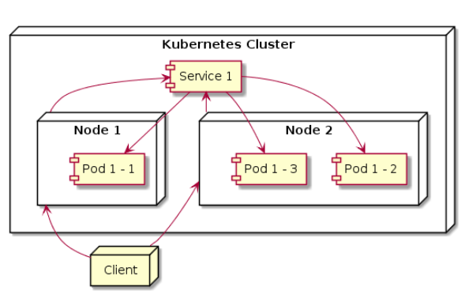

# Catatan Belajar Kubernetes

## Arsitektur Kubernetes


### Kubernetes Master
- **kube-apiserver** bertugas sebagai API yang digunakan untuk berinteraksi dengan Kubernetes Cluster
- **etcd** bertugas sebagai database untuk menyimpan data Kubernetes Cluster
- **kube-scheduler** bertugas untuk memperhatikan aplikasi yang kita jalankan dan meminta Node untuk menjalankan aplikasi yang kita jalankan
- **kube-controller-manager** bertugas untuk melakukan kontrol terhadap Kubernetes Cluster
- **cloud-controller-manager** bertugas untuk melakukan kontrol terhadap interaksi dengan cloud provider

### Kubernetes Nodes
- **kubelet** berjalan di setiap Node dan bertugas untuk memastikan bahwa aplikasi kita berjalan di Node
- **kuber-proxy** berjalan di setiap Node dan bertugas sebagai proxy terhadap arus network yang masuk ke aplikasi kita dan sebagai load balancer juga
- **container-manager** berjalan di setiap Node dan bertugas sebagai container manager. Kubernetes mendukung beberapa container manager seperti Docker, containerd, rktlet, etc.

### Alur Kerja Kubernetes

#### Penjelasan
- Sebelum membuat configuration file, kita upload data aplikasi-aplikasi yang telah dibuild menjadi image ke image registry (ex: dockerhub, etc.)
- Kubernetes master akan mendistribusikan ke dalam Node dan memerintahkan kubelet untuk mengambil alih
- Kubelet akan memerintahkan docker atau container manager untuk pull image dari image registry, dan build container setelah itu

## Running Kubernetes Cluster Locally
- Install Using Minikube
- https://github.com/kubernetes/minikube
  
- Run minikube using VirtualBox
  ```
  minikube start --driver=virtualbox
  ```

#### Menginstall kubectl
https://kubernetes.io/id/docs/tasks/tools/install-kubectl/

## Kubernetes Node
- Node adalah worker machine di k8s, sebelumnya juga disebut minion
- Node bisa saja dalam bentuk VM (Cloud, etc.) atau server fisik
- Di dalam Node selalu terdapat beberapa kubelet, kube-proxy dan container manager

#### Melihat Semua Node
  ```
  kubectl get node
  ```
#### Melihat Detail Node
  ```
  kubectl describe node {nama_node}
  ```

## Kubernetes Pod
- Pod adalah unit terkecil yang bisa di-deploy di Kubernetes Cluster
- Pod berisi satu atau lebih container
- Secara sederhana Pod adalah aplikasi kita yang running di Kubernetes Cluster
- Satu Pod hanya bisa running di Satu Node saja

### Diagram Sederhana Pod


### Kenapa Butuh Pod?
- Kalau langsung menggunakan Container, Kubernetes hanya bisa satu spesifik container manager saja
- Sehingga dibuatlah satu abstraction layer bernama Pod
- Agar lebih memudahkan proses scaling

#### Melihat Semua Pod
  ```
  kubectl get pod
  ```

#### Melihat Detail Pod
  ```
  kubectl describe pod {nama_pod}
  ```

### Membuat Pod
- Template pod.yaml
  ```
    apiVersion: v1
    kind: Pod
    metadata:
      name: pod-name
    spec:
      containers:
        - name: container-name
          image: image-name
          ports:
            - containerPort: 80
  ```
- **nama pod harus unique**

- Create command
  ```
  kubectl create -f {nama_file}
  ```

- Melihat pod yeng telah dibuat
  ```
  kubectl get pod
  ```
  ```
  kubectl get pod -o wide
  ```
  ```
  kubectl describe pod namepod
  ```

#### Mengakses Pod
  ```
  kubectl port-forward {nama_pod} portBinding:portPod
  ```
- example :
  `kubectl port-forward nginx 8889:80`


## Label
- Label adalah informasi tambahan yang ada di dalam resource Kubernetes
- Berguna untuk memberi tanda pada Pod, mengorganisir Pod
- Label tidak hanya bisa digunakan pada Pod, tapi pada semua resource di Kubernetes, seperti Replication Controller, Replica Set, Service, etc.

#### Show labels dari Pod
  ```
  kubectl get pods --show-labels
  ```

### Menambah atau Mengubah Label di Pod
**tidak disarankan, lebih bagus jika ditaruh di file config yaml**
- Menambah
  ```
  kubectl label pod {nama_pod} {key}={value}
  ```
- Mengubah
  ```
  kubectl label pod {nama_pod} {key}={value} --overwrite
  ```

#### Mencari Pod dengan label
- `kubectl get pods -l {key}` -> get Pod with label based on key
- `kubectl get pods -l {key}={value}` -> get Pod with label based on key and value
- `kubectl get pods -l '!{key}'` -> get Pod with label where not having this key
- `kubectl get pods -l {key}!={value}` -> get Pod with label where key not having this value
- `kubectl get pods -l '{key} in (value1, value2)'` -> get Pod with label with multiple value
- `kubectl get pods -l '{key} notin (value1, value2)'`

#### Mencari Pod dengan beberapa label
- `kubectl get pods -l key1,key2`
- `kubectl get pods -l key1=value,key2=value`
- `kubectl get pods -l key1,key2=value`


## Annotation
- Annotation mirip dengan Label, hanya tidak dapat difilter seperti label
- Annotation biasa digunakan untuk menambahkan informasi tambahan dalam ukuran besar
- Annotation bisa menampung informasi sampai 256kb

**Melihat Annotation harus lewat describe**
- `kubectl describe pod {nama_pod}`

#### Menambahkan Annotation ke Pod
- `kubectl annotate pod {nama_pod} {key}={value}`

#### Mengubah Annotation yang sudah ada
- `kubectl annotate pod {nama_pod} {key}={value} --overwrite`


## Namespace

### Kapan Menggunakan Namespace
- Ketika resources di Kubernetes sudah terlalu banyak
- Ketika butuh memisahkan resources untuk multi-tenant, team atau environment
- Nama resources bisa sama jika berada di namespace yang berbeda

#### Melihat Namespace
- `kubectl get namespaces`
- `kubectl get namespace`
- `kubectl get ns`

#### Melihat Pod di Namespace
- `kubectl get pod --namespace {nama_namespace}`
- `kubectl get pod -n {nama_namespace}`

#### Membuat Namespace
  ```
  kubectl create -f {nama_file}
  ```
#### Membuat Pod di suatu Namespace
  ```
  kubectl create -f {nama_file}.yaml --namespace {nama_namespace}
  ```
#### Menghapus Namespace
- **Semua resource (pod, dll.) yang ada di dalam namespace juga akan ikut terhapus**
  ```
  kubectl delete namespace {nama_namespace}
  ```

### Tentang Namespace
- Pod dengan nama yang sama boleh berjalan asalkan di Namespace yang berbeda
- Namespace bukanlah cara untuk mengisolasi resource, namespace hanya untuk grouping saja
- Walaupun berbeda namespace, pod akan tetap bisa saling berkomunikasi dengan pod lain di namespace yang berbeda


## Menghapus Pod
- `kubectl delete pod {nama_pod}`
- `kubectl delete pod {nama_pod1} {nama_pod2} ...`

### Menghapus Pod Menggunakan Label
  ```
  kubectl delete pod -l {key}={value}
  ```

### Menghapus Semua Pod dalam suatu Namespace
  ```
  kubectl delete pod --all --namespace {nama_namespace}
  ```

## Probe

### Liveness, Readiness, Startup Probe
- Kubelet menggunakan **Liveness Probe** untuk mengecek kapan perlu untuk restart pod (semacam health check). Jika saat dicek oleh liveness probe Pod tidak merespon, kubelet akan secara otomatis me-restart Pod.
- Kubelet menggunakan **Readiness Probe** untuk mengecek apakah Pod siap menerima traffic.
- Kubelet menggunakan **Startup Probe** untuk mengecek apakah Pod sudah berjalan, jika belum, maka kubelet tidak akan melakukan pengecekan liveness dan readiness
- Startup Probe cocok untuk Pod yang membutuhkan proses startup lama, ini dapa digunakan untuk memastikan Pod tidak mati oleh kubelet sebelum selesai berjalan dengan sempurna

### Mekanisme Pengecekan Probe
- HTTP Get (Cocok dipakai aplikasi web)
- TCP Socket (Alternatif dari HTTP Get, jika aplikasi hanya berbentuk socket saja)
- Command Exec (Alternatif dari kedua hal di atas)

### Konfigurasi Probe
- **initialDelaySeconds**, waktu delay setelah container jalan dan dilakukan pengecekan, default 0
- **periodSeconds**, seberapa sering pengecekan dilakukan, default 10
- **timeoutSeconds**, waktu timeout ketika pengecekan gagal, default 1
- **successThreshold**, ambang batas jumlah minimum dianggap sukses setelah berstatus failure, default 1
- **failureThreshold**, ambang batas jumlah minimum dianggap gagal, default 3

## Replication Controller
- Replication Controller bertugas untuk emmastikan bahwa Pod selalu berjalan
- Jika tiba-tiba Pod mati atau hilang, maka Replication Controller secara otomatis akan menjalankan Pod yang mati atau hilang tersebut
- Replication Controller biasanya ditugaskan untuk manage lebih dari 1 Pod
- Replication Controller akan memastikan jumlah Pod yang berjalan sejumlah yang telah ditentukan. Jika kurang, maka akan menambah Pod baru, jika lebih maka akan menghapus Pod yang sudah ada

### Diagram Replication Controller


### Isi Replication Controller
- Label Selector, sebagai penanda Pod
- Replica Count, jumlah Pod yang seharusnya berjalan
- Pod Template, template yang digunakan untuk menjalankan Pod

### Membuat Replication Controller
  ``` 
  kubectl create -f {nama_file}
  ```

#### Melihat Replication Controller
- `kubectl get replicationcontrollers`
- `kubectl get replicationcontroller`
- `kubectl get rc`

### Menghapus Replication Controller
- Saat kita menghapus Replication Controller, maka secara otomatis Pod yang berada pada label selector dari RC akan ikut terhapus

  ```
  kubectl delete rc {nama_rc}
  ```
- Apabila kita ingin menghapus Replication Controller tanpa menghapus Pod yang berada pada label selectornya, kita bisa tambahkan opsi `--cascade=false` atau `--cascade=orphan`
  ```
  kubectl delete rc {nama_rc} --cascade=false
  ```

## Replica Set
- Pada awalnya Replication Controller digunakan untuk menjaga jumlah replica Pod ddan me-reschedule ulang Pod yang mati atau hilang.
- Namun kini, telah dikenalkan resource baaru yang bernama Replica Set
- **Replica Set** adalah generasi terbaru dari Replication Controller, dan digunakan sebagai pengganti Replication Controller
- Penggunaan Replication Controller untuk saat ini sudah tidak direkomendasikan

### Replica Set Vs Replication Controller
- Replica Set memiliki kemampuan hampir mirip dengan Replication Controller
- Replica Set memiliki label selector yang lebih ekspresif dibandingkan Replication Controller yang hanya memiliki fitur label selector secara match

#### Melihat Replica Set
- `kubectl get rs`

## Label Match Expression

### Operasi di Match Expression
- **In**, value label harus ada di value in
- **NotIn**, value  label tidak boleh ada di value in
- **Exists**, label harus ada
- **NotExists**, label tidak boleh ada

## Upgrade Minikube

### Cek versi terbaru minikube
  ```
  minikube update-check
  ```
- Pastikan menghentikan dan menghapus terlebih dahulu minikube-nya
  ```
  minikube stop
  ```
  ```
  minikube delete
  ```
- Download dan install ulang minikube


## Daemon Set
- Saat menggunakan Replica Set atau Replication Controller, Pod akan dijalankan di dalam Node secara random oleh si Kubernetes
- Jika kita ingin menjalankan Pod di setiap Node yang ada di Kubernetes, dan tiap Pod hanya boleh jalan 1 di Node, kita bisa menggunakan Daemon Set
- By default, Daemon Set akan menjalankan Pod di setiap Node yang ada di Kubernetes Cluster, kecuali jika kita meminta hanya jalan di Node tertentu

### Diagram Daemon Set

- Saat kita membuat Daemon Set, maka Pod dari Daemon Set akan dijalankan di sejumlah Node-nya, tiap-tiap Node

### Contoh Kasus Penggunaan Daemon Set
- Aplikasi untuk monitoring Node
- Aplikasi log di Node
- etc.

#### Melihat DaemonSet
- `kubectl get ds`
- `kubectl get daemonsets`
- `kubectl get daemonset`

#### Describe DaemonSet
- `kubectl describe daemonsets {nama_daemon}`
- `kubectl describe daemonset {nama_daemon}`
- `kubectl describe ds {nama_daemon}`

#### Menghapus DaemonSet
- `kubectl delete daemonsets {nama_daemon}`
- `kubectl delete daemonset {nama_daemon}`
- `kubectl delete ds {nama_daemon}`

## Job
- Job adalah resurce di Kubernetes yang digunakan untuk menjalankan Pod yang hanya butuh berjalan sekali, lalu berhenti
- Pada Replication Controller, Replica Set, Daemon Set, jika Pod mati, maka secara otomatis Pod akan dijalankan ulang
- Berbeda dengan Job. Pada job justru Pod akan langsung mati jika pekerjaannya telah selesai

### Contoh Penggunaan Job
- Aplikasi untuk backup/restore database
- Aplikasi untuk import/export data
- Aplikasi untuk menjalankan proses batch
- etc.

### Melihat Job
  ```
  kubectl get job
  ```

### Menghapus Job
  ```
  kubectl delete job {nama_job}
  ```

## Cron Job
- Cron Job adalah aplikasi untuk penjadwalan yang biasanya ada di sistem operasi Unix
- Dengan menggunakan Cron Job, kita bisa menjadwalkan aplikais berjalan sesuai jadwal yang kita inginkan
- Kubernetes mendukung resource Cron Job, di mana cara kerjanya mirip dengan Job, hanya saja kalau Job berjalan sekali, Cron Job bisa berjalan berulang kali sesuai dengan jadwal yang kita inginkan
- Cron Job juga memungkinkan kita untuk menjalankan aplikasi dengan waktu yang telah ditentukan

### Contoh Penggunaan Cron Job
- Aplikasi untuk membuat laporan harian
- Aplikasi backup data secara berkala
- Aplikasi untuk mengirim data tagihan tiap bulan
- Aplikasi untuk menarik dana pinjaman yang jatuh tempo
- etc.

### Melihat Semua Cron Job
  ```
  kubectl get cronjobs
  ```

### Menghapus Cron Job
  ```
  kubectl delete cronjobs {nama_cronjob}
  ```

## Node Selector
- Kadang kita membuat Node dengan spesifikasi berbeda dari Node biasanya
- Misal Node yang memiliki GPU, atau dengan hardisk SSD
- Dengan Node Selector, kita bisa meminta Kubernetes untuk menjalankan Pod dengan Node tertentu

### Menambahkan Label ke Node
  ```
  kubectl label node {nama_node} {key}={value}
  ```

## All
- Digunakan untuk menampilkan semua objek/resource di kubernetes, default namespace by default
  ```
  kubectl get all
  ```
- Certain namespace
  ```
  kubectl get all --namespace {nama_namespace}
  ```

## Service
- Service adalah resource di Kubernetes yang digunakan untuk membuat satu gerbang untuk mengakses satu atau lebih Pod
- Dalam Production, kita akan selalu menggunakan service untuk mengakses Pod 
- Service memiliki IP Address dan Port yang tidak pernah berubah selama service itu ada
- Client bisa mengakses service tersebut, dan secara otomatis akan meneruskan ke Pod yang ada di belakang service tersebut
- Dengan begini, Client tidak perlu tahu lokasi tiap Pod, dan Pod bisa bertambah, berkurang, atau berpindah, tanpa harus mengganggu Client

### Diagram Akses Pod Secara Langsung

- Pod Client harus menembak ke ketiga Pod A

### Diagram Akses Pod Via Service

- Pod Client hanya perlu menembak ke Service, dan untuk selanjutnya akan di-handle oleh Service

### Membuat Service
- Sama dengan prosedur pembuatan resource lain

### Bagaimana Menentukan Pod untuk Service?
- Service akan mendsitribusikan trafik ke Pod yang ada di belakangnya secara seimbang
- Service akan menggunakan label selector untuk mengetahui Pod mana yang ada di belakang service tersebut

### Melihat Service
  ```
  kubectl get service
  ```

### Menghapus Service
  ```
  kubectl delete service {nama_service}
  ```

### Mengakses Service dari Dalam Cluster
- `kubectl exec {nama_pod} -it -- /bin/sh`
- `curl http://cluster-ip:port/`


#### Menghapus semua resource dari kubernetes
- `kubectl delete all --all`


### Mengakses Service (Manual)
- Cara manual untuk mengakses service yaitu dengan cara membuat service terlebih dahulu, lalu memasukkannya ke dalam konfigurasi aplikasi secara manual

### Mengakses Service (Otomatis)
- Menggunakan Environment Variable
- Menggunakan DNS

* Melihat Environment Variable : `kubectl exec {nama_pod} -- env`

#### Mengakses Menggunakan DNS
  ```
  {nama-service}.{nama-namespace}.svc.cluster.local:{port}
  ```

#### Melihat Semua Endpoint
- `kubectl get endpoints`
- `kubectl get ep`

## External Service
- Biasanya service digunakan sebagai gateway untuk internal Pod
- Tapi service juga bisa digunakan sebagai gateway untuk aplikasi eksternal yang berada di luar kubernetes cluster

### Diagram External Service


### Melihat Service Endpoint
- `kubectl describe service {nama_service}`
- `kubectl get endpoints {nama_service}`


## Mengekspos Service
- Terkadang ada kebutuhan kita untuk mengekspos service keluar
- Tujuannya adalah agar aplikasi dari luar kubernetes cluster bisa mengakses Pod yang berada di belakang service tersebut

### Diagram Mengekspos Service


### Tipe Service
- **ClusterIP**: Mengekspos Service di dalam internal kubernetes cluster
- **ExternalName**: Memetakan Service (mapping) ke External Name
- **NodePort**: Mengekspos Service pada setiap IP node dan port yang sama. Kita dapat mengakses Service dengan tipe ini, dari luar cluster melalui `{NodeIP}:{NodePort}`
- **LoadBalancer**: Mengekspos Service secara eksternal dengan menggunakan LoadBalancer yang disediakan oleh penyedia layanan cloud

### Cara untuk Mengekspos Service
- Dengan menggunakan NodePort, sehingga Node akan membuka port yang akan meneruskan ke Service yang dituju
- Dengan menggunakan LoadBalancer, sehingga service bisa diakses via LoadBalancer, dan LoadBalancer akan meneruskan request ke NodePost dan dilanjutkan ke Service
- Menggunaka Ingress, di mana Ingress adalah resource yang memang ditujukan untuk mengekspos Service, Namun Ingress hanya beroperasi di level HTTP

## Service Node Port

- Saat kita membuat service dan tipenya adalah NodePort, maka Node yang ada di kubernetes akan membuka Port
- Saat Client mengakses ke Node 1, akan diteruskan ke Service 1, dan akan diteruskan lagi ke masing-masing Pod

### Melihat NodePort di Minikube
  ```
  minikube service {nama_service}
  ```

## Service Load Balancer
- Cloud Provider seperti GCP atau AWS biasanya sudah memiliki Load Balancer
- Kubernetes bisa menggunakan LoadBalancer bawaan dari Cloud Provider sebagai cara untuk mengakses service
- LoadBalancer akan melakukan load balance request ke NodePort
- Sayangnya Service LoadBalancer ini tidak bisa di-test di local seperti menggunakan Minikube (harus di cloud provider)

### Diagram Load Balancer

- Dari client bisa langsung menembak dulu ke load balancer, dan akan diteruskan ke Node (akan dipilih ke node yang mana, balancing), dan akan diteruskan lagi ke service yang dituju

### Diagram Multi Load Balancer


## Ingress

### Masalah Saat Mengekspos Service
- Jika menggunakan NodePort
  - Semua Node harus terekspos ke public
  - Client harus tahu semua IP Address semua Node
- Jika Menggunakan LoadBalancer
  - Maka semua LoadBalancer harus terekspos ke public
  - Client harus tahu semua IP Address semua LoadBalancer

### Apa itu Ingress?
- Ingress adalah cara alternatif untuk expose service
- Berberda dengan LoadBalancer atau NodePort, jika menggunakan Ingress, client hanya butuh tahu satu lokasi IP Address Ingress
- Ketika client melakukan request ke Ingress, pemilihan service ditentukan menggunakan hostname dari request
- Ingress hanya mendukung protocol HTTP

### Diagram Ingress

- Client hanya perlu menembak ke Ingress
- Ingress selanjutnya akan melakukan routing
  
  **Ingress bisa berbentuk NGINX**

### Menjalankan Ingress di Minikube
1. `minikube addons list`
2. `minikube addons enable ingress`
3. `kubectl get pods --namespace kube-system`


### Melihat IP Minikube
- `minikube ip`


## Multi Container Pod
- Saat menggunakan Docker, kita selalu diajarkan bahwa 1 container untuk 1 aplikasi
- Di kubernetes sendiri sedikit berbeda, saat kita deploy aplikasi kita, maka dia akan disimpan dalam 1 pod. Kenapa pod? karena dalam satu pod kita bisa menambahkan banyak container
- Ini sangat cocok jika kita butuh aplikasi yang berjalan di beberapa container, dan jika ingin scale, harus semuanya ikut scale

### Diagram Multi Container Pod

- Perlu diingat, ketika menggunakan multi container, maka port di tiap container harus unique agar tidak bentrok


## Volume
- Berkas di dalam container tidak bersifat permanen, akan terhapus seiring dihapusnya Pod atau Container
- Secara sederhana, Volume adalah sebuah direktori yang bisa diakses oleh container yang ada di Pod.

### Jenis Volume
- **emptyDir**, direktori sederhana yang kosong
- **hostPath**, digunakan untuk sharing direktori dari node ke pod
- **gitRepo**, direktori yang dibuat pertama kali ketika clone sebuah repository git
- **nfs**, sharing network file system
- Lainnya, https://kubernetes.io/docs/concepts/storage/volumes/#volume-types

### Sharing Volume
- Dalam suatu Pod, kita dapat membuat lebih dari satu Container. Oleh karena itu, Volume dari suatu Pod bisa kita share ke beberapa Container
- Hal ini sangat cocok ketika kita butuh sharing direktori antar container, misal container pertama membuat file, container kedua memproses file


## Environment Variable
- Ketika kita membuat aplikasi, sering sekali kita butuh data konfigurasi
- Best practice untuk menyimpan data konfigurasi adalah di **environment**, sehingga bisa diubah-ubah secara dinamis dan juga centralized
- Kubernetes mendukung environment variable untuk Pod

## ConfigMap
- Kubernetes memiliki kemampuan untuk memisahkan konfigurasi dalam object bernama ConfigMap
- In the simple terms, ConfigMap is a way to store configuration data in Kubernetes
- Bentuk ConfigMap adalah sebuah Map yang berisi key-value
- Aplikasi tidak perlu membaca konfigurasi langsung ke dalam ConfigMap, melainkan Kubernetes akan mengirim konfigurasi di ConfigMap ke dalam env variable di container

### Problem dengan Hardcode Konfigurasi
- Saat kita hardcode konfigurasi environment variable di file yaml, artinya kita harus siap-siap membuat file config yang berbeda untuk setiap environment
- Sebagai contoh, ketika kita punya environment untuk production, development, qa, dll, maka kita harus membuat file config yang berbeda untuk setiap environment
- Jika sampai lupa untuk update konfigurasi, maka dapat terjadi kesalahan konfigurasi environment

### Diagram ConfigMap


#### Melihat dan Menghapus ConfigMap
- `kubectl get configmaps`
- `kubectl describe configmap {nama_configmap}`
- `kubectl delete configmap {nama_configmap}`

## Secret
Ketika kita menggunakan ConfigMap, data yang ada di dalam ConfigMap dianggap tidak sensitive karena terekspos. <br>

Terkadang pada konfigurasi aplikasi kita, butuh data yang sifatnya sensitif, seperti `DB_URI`, API Key, Secret Key, dsb. Untuk menyimpan jenis data seperti itu, kita bisa menggunakan fitur Secret di Kubernetes. Secret mirip dengan ConfigMap, berisikan data pair key-value. <br>

Kubernetes menyimpan Secret secara aman dengan cara hanya mendistribusikan Secret pada Node yang memang hanya membutuhkan Secret tersebut, letak penyimpananannya terdapat pada memory di Node dan tidak pernah disimpan di physical storage. <br>

Di master Node sendiri (etcd), Secret disimpan dengan cara di-encrypt, sehingga menjadi lebih aman. Secara sederhana, kita menggunakan ConfigMap untuk konfigurasi yang bersifat tidak sensitif, dan gunakan Secret apabila konfigurasi bersifat sensitif. <br>

## Downward API
Konfigurasi yang bisa kita set secara manual bisa ditangani dengan baik emnggunakan ConfigMap dan Secret, namun bagaimana dengan konfigruasi yang dinamis? Seperti informasi Pod dan Node? <br>

Kubernetes memiliki Downward API. Downward API bisa membantu kita untuk mengambil informasi seputar Pod dan Node melalui environment variable. <br>
<br>

### List metadata Downward API
| Metadata        | Keterangan                    |
| --------------- | ----------------------------- |
| requests.cpu    | Jumlah CPU yang di request    |
| requests.memory | Jumlah Memory yang di request |
| limits.cpu      | Jumlah limit maksimal CPU     |
| limits.memory   | Jumlah limit maksimal Memory  |
| metadata.name                   | Nama pod       |
| metadata.namespace              | Namespace pod  |
| metadata.uid                    | Id pod         |
| metadata.labels\[‘<KEY>’\]      | Label pod      |
| metadata.annotations\[‘<KEY>’\] | Annotation pod |
| status.podIP            | IP address pod         |
| spec.serviceAccountName | Nama service account pod|
| spec.nodeName           | Nama node               |
| status.hostIP           | IP address  node        |

## Manage Kubernetes Object

### Imperative Management
| Perintah                                  | Keterangan                   |
| ----------------------------------------- | ---------------------------- |
| kubectl create -f namafile.yaml           | Membuat kubernetes object    |
| kubectl replace -f namafile.yaml          | Mengupdate kubernetes object |
| kubectl get -f namafile.yaml -o yaml/json | Melihat kubernetes object    |
| kubectl delete -f namafile.yaml           | Menghapus kubernetes object  |

### Declarative Management
| Perintah                       | Keterangan                                |
| ------------------------------ | ----------------------------------------- |
| kubectl apply -f namafile.yaml | Membuat atau mengupdate kubernetes object |
<br>

Saat menggunakan declarative management, file konfigurasi akan disimpan di dalam annotations object (biasa berbentuk last-applied-configuration). Hal ini sangat bermanfaat ketika digunakan dalam `Deployment`. <br>

Rata-rata sekarang kebanyakan Declarative Management lebih sering digunakan dibandingkan Imperative Management

## Deployment
Kubernetes memiliki fitur Deployment, yaitu sebuah resource untuk melakukan deployment aplikasi dan update secara deklaratif menggunakan file konfigurasi (yaml). <br>

Update aplikasi secara manual bukanlah best-practice, kesalahan kecil yang kita lakukan saat update secara manual, bisa menyebabkan downtime sewaktu-waktu. <br>

Saat kita membuat Deployment, secara otomatis Kubernetes akan membuat ReplicaSet, yang akan secara otomatis membuat Pod. Membuat Deployment hampir sama seperti membuat ReplicationSet. <br>

### Diagram Deployment

- Deployment akan membuat ReplicaSet, dan selanjutnya tugas ReplicaSet untuk membuat Pod secara otomatis
- Membuat deployment dari file konfigurasi selalu disarankan untuk menggunakan declarative management (**apply**)
```
kubectl apply -f nama_file.yaml
```

### Update Deployment
- Untuk update deployment, kita hanya tinggal `apply` lagi untuk mengupdate Deployment terbaru
- Saat deployment terbaru dieksekusi, secara otomatis Deployment akan membuat ReplicaSet baru, lalu menyalakan Pod baru, setelah Pod siap, Deployment akan menghapus Pod lama secara otomatis
- Semua proses di atas dapat berjalan otomatis, sehingga tidak terjadi downtime

#### Flow Update Deployment
1. Deployment membuat ReplicaSet baru
2. ReplicaSet membuat Pod baru
3. Pod baru siap digunakan
4. Deployment menghapus Pod lama yang sudah dimatikan
5. ReplicaSet lama tidak dihapus untuk keperluan Rollback Deployment

### Rollback Deployment
- Ketika terjadi masalah ketika deploy aplikasi terbaru, cara yang paling mudah agar tidak terjadi error adalah rollback ke Deployment sebelumnya <br>

Beberapa cara rollback Deployment:
1. Update menggunakan Deployment baru, namun versi aplikasi di-set ke versi sebelumnya (cara manual)
2. Menggunakan fitur rollout Kubernetes untuk rollback ke versi Deployment sebelumnya (cara mudah)
  
#### Kubernetes Rollout
| Kubernetes Rollout Command          | Keterangan                 |
| ----------------------------------- | -------------------------- |
| kubectl rollout history {object} {name} | Melihat history rollout    |
| kubectl rollout pause {object} {name}   | Menandai sebagai pause     |
| kubectl rollout resume {object} {name}  | Resume pause               |
| kubectl rollout restart {object} {name} | Merestart rollout          |
| kubectl rollout status {object} {name}  | Melihat status rollout     |
| kubectl rollout undo {object} {name}    | Undo ke rollout sebelumnya |


